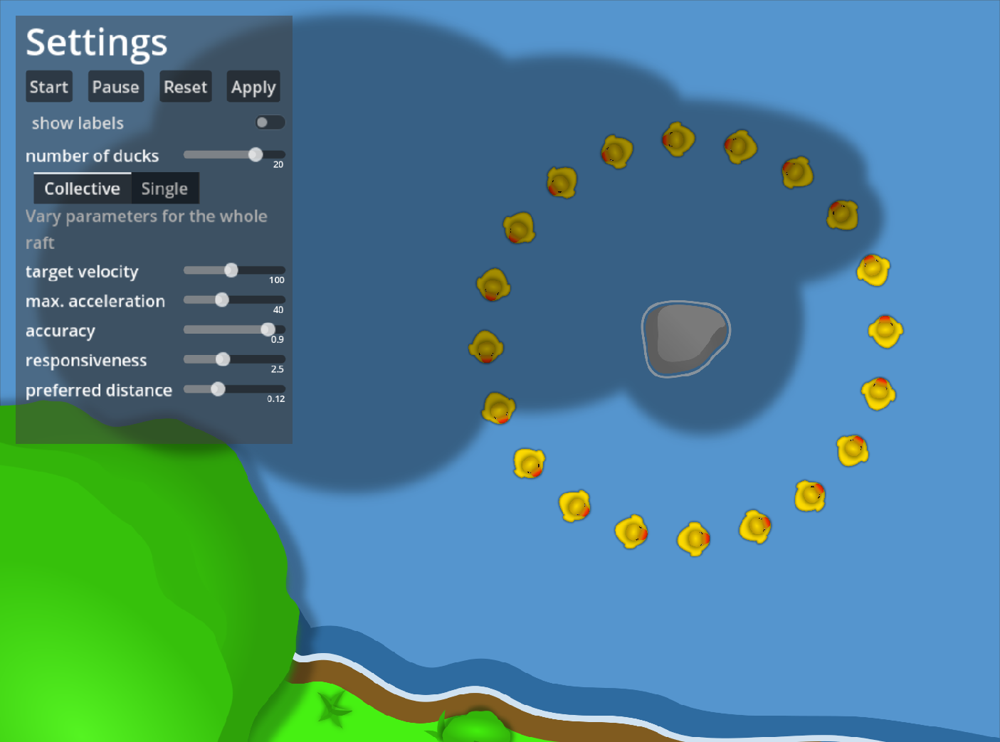
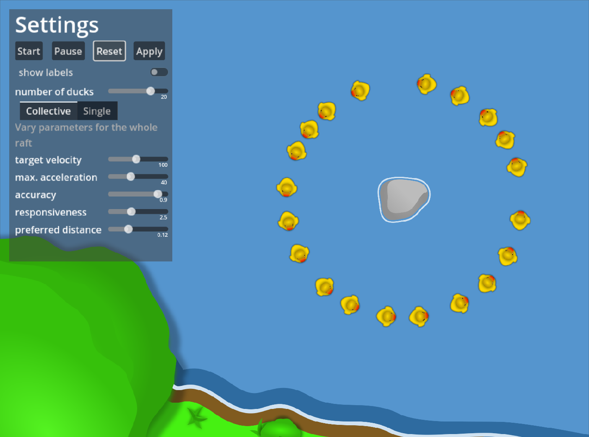
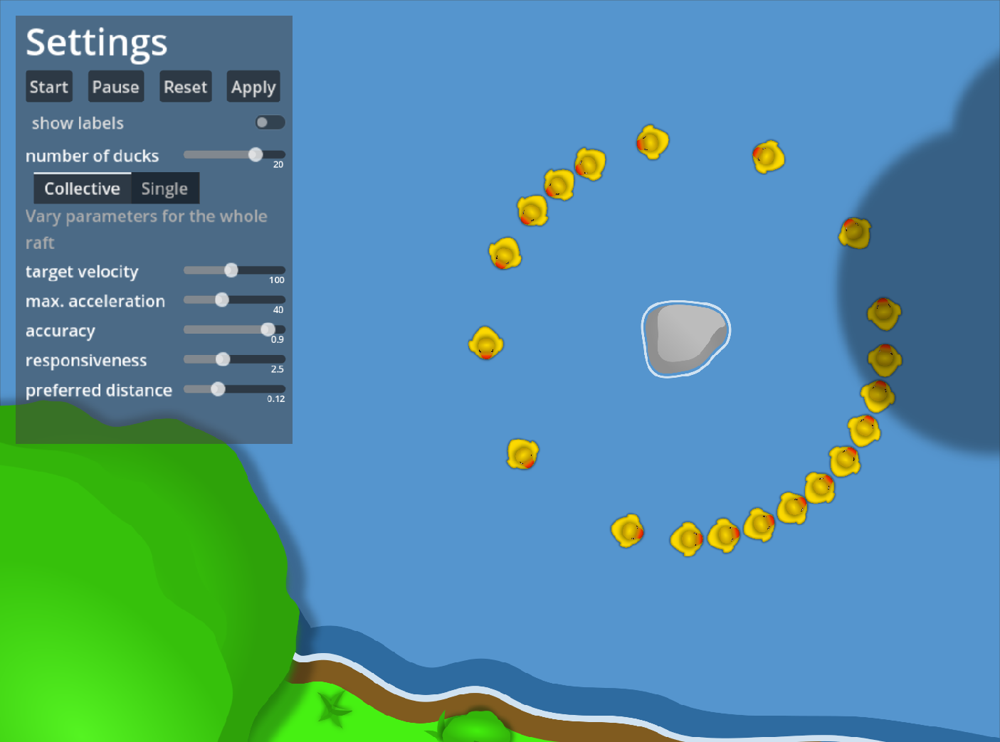

# Duck Traffic

Traffic simulation with duck-agents using Godot 4.

## How to run
Either open the project in Godot 4 itself or unpack and run the binary for your os from the `bin/`-directory.

## Example
Below are a few frames of a simulation using the default parameters.

## GUI
### General
* **Start|Pause|Reset|Apply**: basic controls for the simulation; after changing settings, click either `Reset` or `Apply`
* **show labels** toggle to show labels identifying individual ducks
* **number of ducks** number of ducks in the simulation

### Dynamics
There is a number of options to configure duck behavior.
These are organized in two categories, i.e. `Collective` (settings for the entire raft of ducks) and `Single` (settings for a single duck, labeled as `duck0`).
* **target velocity** target/maximum velocity
* **max. acceleration** maximum acceleration/deceleration
* **accuracy** accuracy with which the target velocity is kept
* **responsiveness** factor for ability to temporarily exceed maximum deceleration in an emergency
* **preferred distance** minimum distance at which a duck feels comfortable with their target velocity (reduces target velocity if distance falls under this value)